# Project Title
A Simple Compiler Based on Scanning and Filtering, Lexical Analysis, Symbol Table Construction and Management, Detecting Simple Syntax Errors in addition to Use of CFGs for Parsing.
# Introduction
A compiler is a special program that processes statements written in a particular programming language and turns them into machine language or "code" that a computer’s processor uses. Typically, a programmer writes language statements in a language such as Pascal or C one line at a time using an editor.

#	Step 0: Input Step
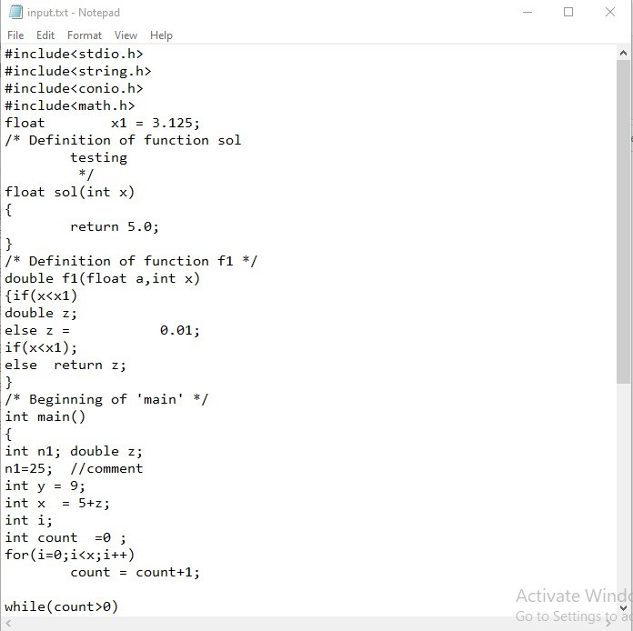

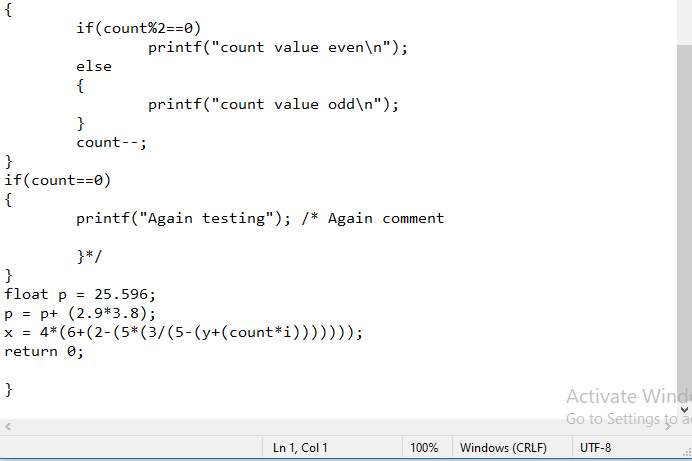
#	Step 1 Scanning and Filtering a Source Program
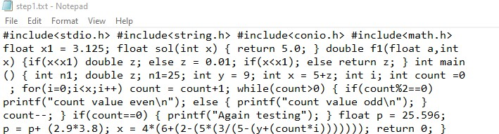

#	Step 2: Lexical Analysis
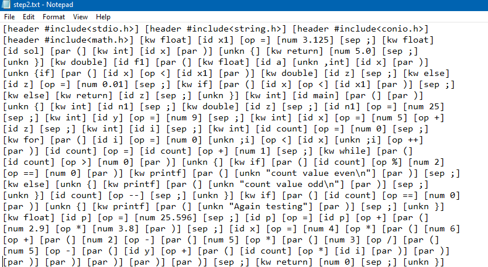

#	Step 3: Symbol Table Construction and Management
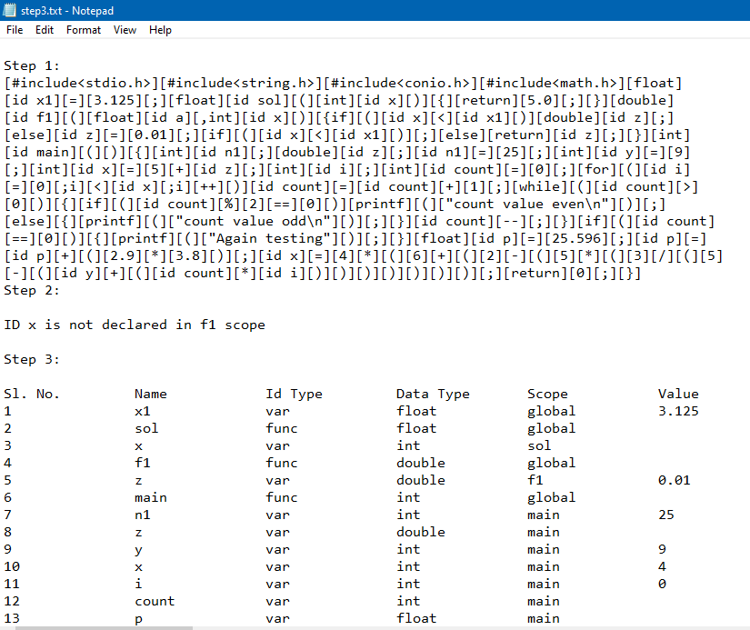

#	Step 4: Detecting Simple Syntax Errors
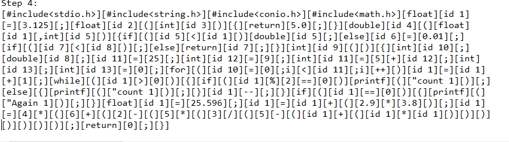

* Adding Line Numbers and Removing Comments
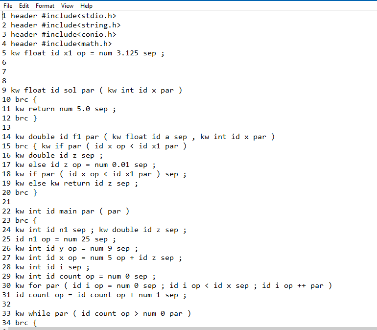

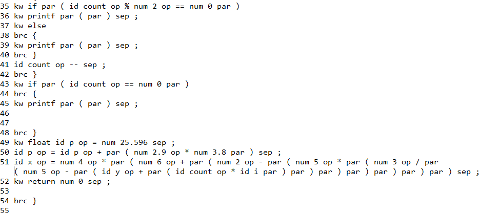

* Showing Error
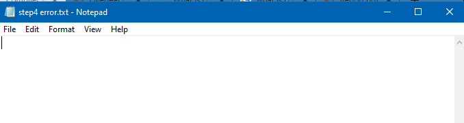 

# Step 5: Use of CFGs for Parsing
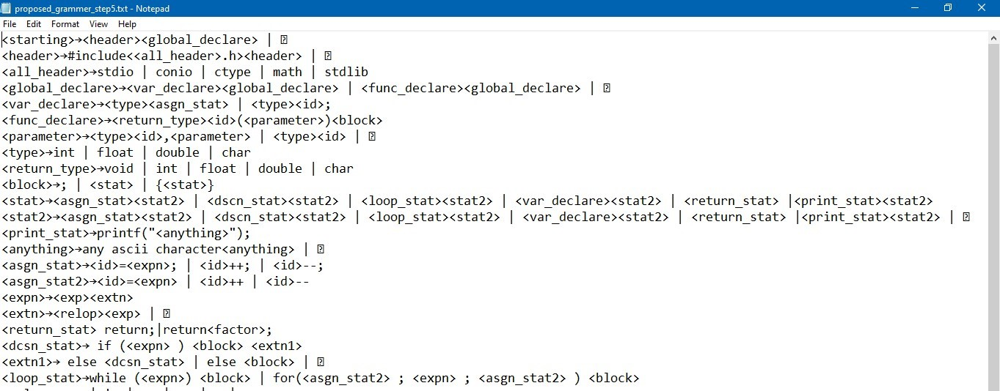 

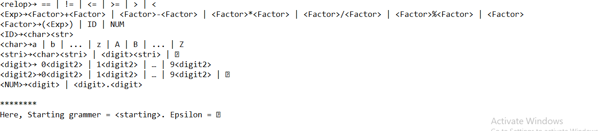 
* Output of Step 5
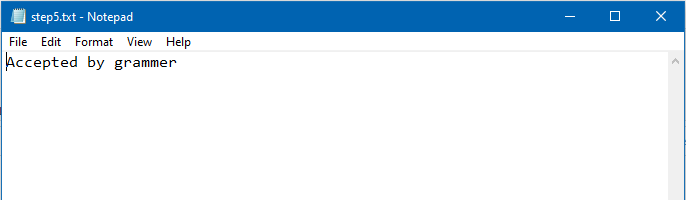 

